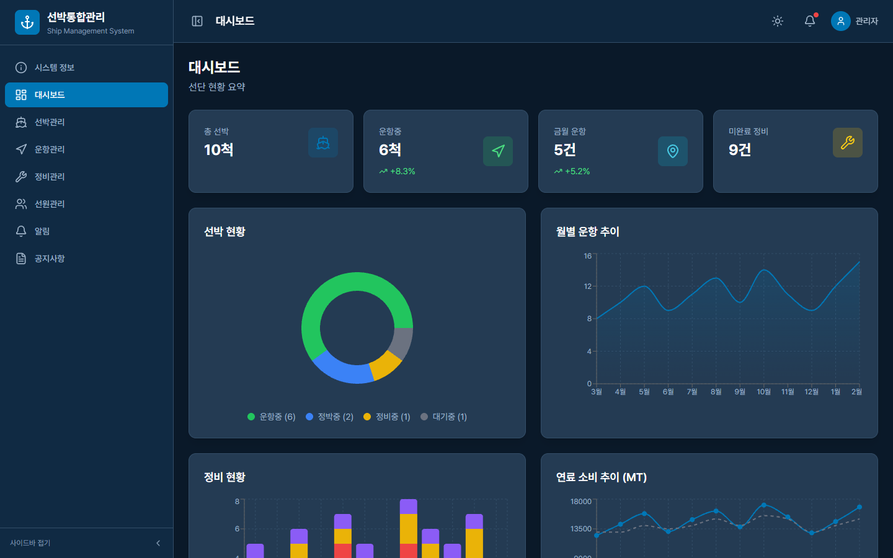
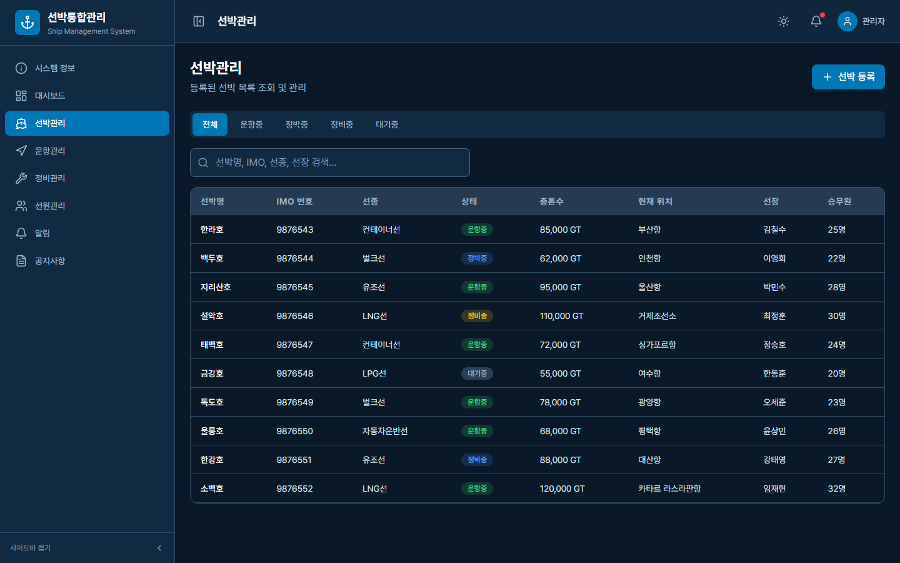
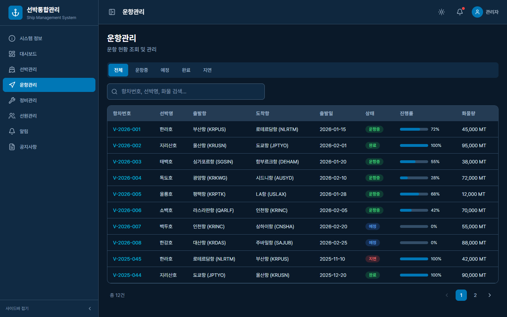
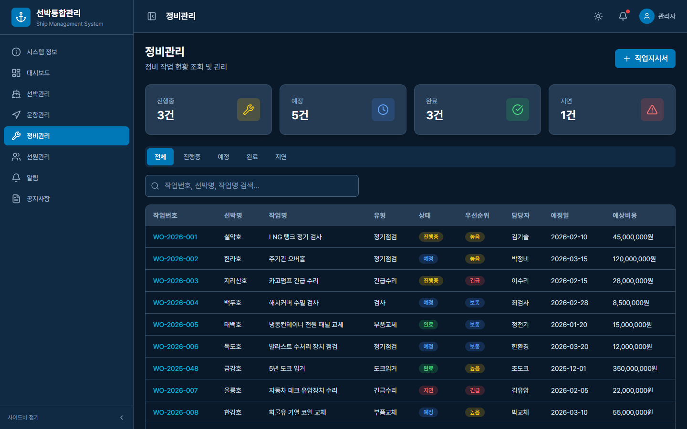

# 선박통합관리시스템

> Ship Integrated Management System

React 19 + TypeScript + Tailwind CSS 기반의 선박통합관리 웹 애플리케이션입니다.

## 화면 미리보기

| 대시보드 | 선박관리 |
|---|---|
|  |  |

| 운항관리 | 정비관리 |
|---|---|
|  |  |

---

## 주요 기능

- **대시보드** — KPI 카드, 함대 현황 차트, 실시간 알림
- **선박관리** — 선박 목록, 상세 정보, 신규 등록
- **운항관리** — 운항 목록, 상세 조회, 운항 일정
- **정비관리** — 정비 이력, 상세 조회, 작업 지시
- **선원관리** — 선원 목록, 상세 정보, 배정 관리
- **알림 / 공지사항**

## 기술 스택

| 항목 | 버전 |
|------|------|
| React | 19 |
| TypeScript | CRA 기본 |
| Tailwind CSS | v3 |
| react-router-dom | v7 |
| recharts | v3 |
| lucide-react | latest |

## 개발 실행

```bash
npm install
npm start
```

## ⚠️ 저작권 안내

**Copyright (c) 2026 heralife. All Rights Reserved.**

본 소프트웨어는 저작권법의 보호를 받습니다.
저작권자의 사전 서면 동의 없이 무단 복제, 배포, 수정, 상업적 이용을 금지합니다.
자세한 내용은 [LICENSE](./LICENSE) 파일을 참고하세요.
